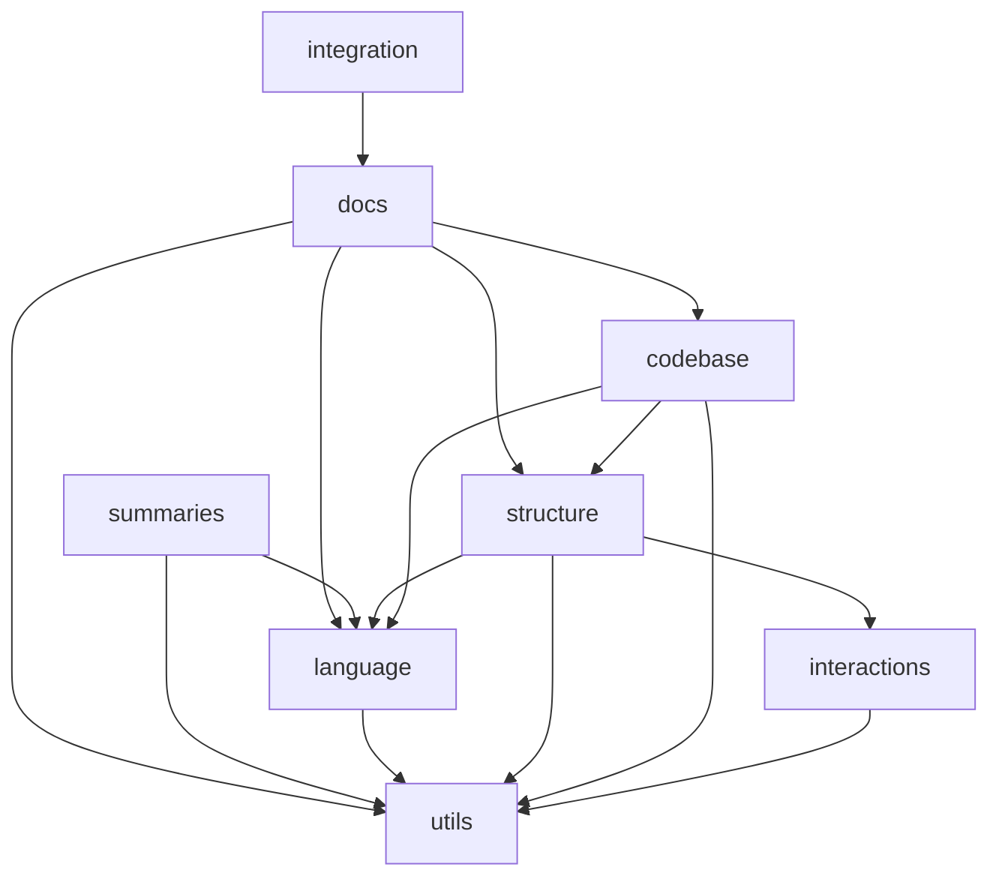

# Code Overview

<!---Documatic-section-Codebase Structure-start--->
## Codebase Structure

The codebase has a 2-deep folder structure,
                with 57 code files in total.

<!---Documatic-block-system-architecture-start--->

<!---Documatic-block-system-architecture-end--->
<!---Documatic-section-Codebase Structure-end--->

<!---Documatic-section-Key Objects-start--->
## Key Objects

There are exposed imports at level-1
from the source directory (docserver)

**`docserver/docs/`**

* `docserver.docs.technical.TechnicalDoc`

**`docserver/summaries/`**

* `docserver.summaries.functions.summarise_function`

**`docserver/utils/`**

* `docserver.utils.config.parse_config`
* `docserver.utils.parse_python.parse_all_type_hints`
* `docserver.utils.requests.post`
* `docserver.utils.source_control.GitSourceControlManager`

**`docserver/integratio/`**

* `docserver.integration.notion.deploy_to_notion`

**`docserver/language/`**

* `docserver.language.detector.LanguageDetector`

**`docserver/structure/`**

* `docserver.structure.setup.DevOnboardingParser`
* `docserver.structure.setup.OnboardingParser`
* `docserver.structure.structure.PythonCodebaseStructureAnalyser`

**`docserver/codebase/`**

* `docserver.codebase.python.PythonCodebaseAnalyser`

**`docserver/interactions/`**

* `docserver.interactions.ci.CIParser`
* `docserver.interactions.containers.ContainerParser`
* `docserver.interactions.interactions.describe_file_architecture`
* `docserver.interactions.packages.read_packages`
* `docserver.interactions.tools.PythonEnvVar`
<!---Documatic-section-Key Objects-end--->

<!---Documatic-section-Class Hierarchy-start--->
## Class Hierarchy

* Document -> docserver.docs.technical.TechnicalDoc

* Enum -> docserver.summaries.classes.ObjectType

* SourceControlManager -> docserver.utils.source_control.NoSourceControlManager

* SourceControlManager -> docserver.utils.source_control.GitSourceControlManager

* ast.NodeTransformer -> docserver.utils.parse_python.CodeCondenser

* Block -> docserver.utils.blocks.ListBlock

* ParentBlock -> docserver.utils.blocks.SectionBlock

* Block -> docserver.utils.blocks.ParagraphBlock

* Block -> docserver.utils.blocks.HeaderBlock

* Block -> docserver.utils.blocks.CodeBlock

* Block -> docserver.utils.blocks.TableBlock

* ast.NodeVisitor -> docserver.language.parsing.python.PythonObjectReader

* LanguageFactory -> docserver.language.factories.python.PythonFactory

* CodeImportance -> docserver.structure.code_importance.PythonCodeImportance

* CodebaseStructureAnalyser -> docserver.structure.structure.PythonCodebaseStructureAnalyser

* SourceDirectoryInferer -> docserver.structure.structure.PythonSourceDirectoryInferer

* ast.NodeVisitor -> docserver.structure.imports.ImportNodeIdentifier

* Enum -> docserver.structure.files.FileImportsBehaviour

* Enum -> docserver.structure.files.FileDetailedBehaviour

* Enum -> docserver.structure.classes.ClassHierarchy

* EntrypointParser -> docserver.structure.entrypoint.PythonEntrypointParser

* CodebaseAnalyser -> docserver.codebase.python.PythonCodebaseAnalyser

* BaseDBParser -> docserver.interactions.databases.MongoDBParser

* BaseDBParser -> docserver.interactions.databases.RedisParser
<!---Documatic-section-Class Hierarchy-end--->

<!---Documatic-section-File IO-start--->
## File IO

<!---Documatic-block-file-io-start--->
The following files have file read operations

* docserver.docs.technical
* docserver.docs.utils.onboarding
* docserver.utils.io
* docserver.utils.config
* docserver.structure.code_importance
* docserver.structure.setup
* docserver.interactions.ci
* docserver.interactions.containers
* docserver.interactions.packages

The following files have file write operations

* docserver.docs.core
* docserver.docs.utils.onboarding
<!---Documatic-block-file-io-end--->
<!---Documatic-section-File IO-end--->